***
***
***
# RWD : Responsive Web Design


## Responsive web design is the practice of building a website suitable to work on every device and every screen size, no matter how large or small, mobile or desktop. 

***
***

### Responsive vs. Adaptive vs. Mobile

***Responsive***
generally means to react quickly and positively to any change

***adaptive***
means to be easily modified for a new purpose or situation, such as change.

***Mobile***
on the other hand, generally means to build a separate website commonly on a new domain solely for mobile users.

## Responsive web design is broken down into three main components, including 

### 1. flexible layouts : practice of building the layout of a website with a flexible grid, capable of dynamically resizing to any width. Flexible grids are built using relative length units, most commonly percentages or em units. These relative lengths are then used to declare common grid property values such as width, margin, or padding.

```
Relative Viewport Lengths
* vw
Viewports width
* vh
Viewports height
* vmin
Minimum of the viewport’s height and width
* vmax
Maximum of the viewport’s height and width
```

*NOTE : Flexible layouts do not advocate the use of fixed measurement units, such as pixels or inches. The formula is based around taking the target width of an element and dividing it by the width of it’s parent element. The result is the relative width of the target element ( target ÷ context = result ).*

### So how to have have the section on the left and the aside on the right, with equal margins between the two?

```html
<div class="container">
  <section>...</section>
  <aside>...</aside>
</div>
```

```css
.container {
  width: 538px;
}
section,
aside {
  margin: 10px;
}
section {
  float: left;
  width: 340px;
}
aside {
  float: right;
  width: 158px;
}
```

[SEE RESULT](https://codepen.io/shayhowe/pen/jelsr)

***

Using the **flexible grid formula** we can take all of the fixed units of length and turn them into relative units.

```css
section,
aside {
  margin: 1.858736059%; /*  10px ÷ 538px = .018587361 */
}
section {
  float: left;
  width: 63.197026%;    /* 340px ÷ 538px = .63197026 */   
}
aside {
  float: right;
  width: 29.3680297%;  /* 158px ÷ 538px = .293680297 */
}
```

[SEE RESULT](https://codepen.io/shayhowe/pen/zhAsj)

***

***

### 2. media queries : were built as an extension to media types commonly found when targeting and including styles.

There are a couple different ways to use media queries:
1. @media rule
2. @import rule

```html
<!-- Separate CSS File -->
<link href="styles.css" rel="stylesheet" media="all and (max-width: 1024px)">
```

```css
/* @media Rule */
@media all and (max-width: 1024px) {...}

/* @import Rule */
@import url(styles.css) all and (max-width: 1024px) {...}
```

***

### Logical Operators in Media Queries

There are three different logical operators available for use within media queries, including:
1. **and** : allows an extra condition to be added.

```css
@media all and (min-width: 800px) and (max-width: 1024px) {...}
```

2. **not** : negates the query, specifying any query but the one identified.

```css
@media not screen and (color) {...}
```

3. **only** : is a new operator and is not recognized by user agents using the HTML4 algorithm, thus hiding the styles from devices or browsers that don’t support media queries.

Below, the expression selects only screens in a portrait orientation that have a user agent capable of rending media queries.

```css
@media only screen and (orientation: portrait) {...}
```

```
NOTE : Omitting a Media Type
When using the not and only logical operators the media type may be left off. In this case the media type is defaulted to all.
```

***

### Media Features in Media Queries

Media features identify what attributes or properties will be targeted within the media query expression.


* :pushpin: Height & Width Media Features

```css
@media all and (min-width: 320px) and (max-width: 780px) {...}
```

**min-width** and **max-width** help build responsive websites on desktops and mobile devices equally, avoiding any confusion with device features.

* :pushpin: Orientation Media Feature

The orientation media feature determines if a device is in the landscape or portrait orientation. and this media feature plays a large part with mobile devices.

```css
@media all and (orientation: landscape) {...}
```

* :pushpin: Aspect Ratio Media Features

The value for the aspect ratio feature consist of two positive integers separated by a forward slash. The first integer identifies the width in pixels while the second integer identifies the height in pixels.

```css
@media all and (min-device-aspect-ratio: 16/9) {...}
```

In addition to the aspect ratio media features there are also pixel-ratio media features.

```css
@media only screen and (-webkit-min-device-pixel-ratio: 1.3), only screen and (min-device-pixel-ratio: 1.3) {...}
```

* :pushpin: Resolution Media Feature (Dots per inch or DPI)

This feature will accept dots per pixel (1.3dppx), dots per centimeter (118dpcm), and other length based resolution values.

```css
@media print and (min-resolution: 300dpi) {...}
```

* :pushpin: Other Media Features (less common)
  * color
  * color-index
  * monochrome
  * identifying bitmap devices with the grid feature
  * identifying the scanning process of a television with the scan feature

***

Media Queries Demo

```css
@media all and (max-width: 420px) {
  section, aside {
    float: none;
    width: auto;
  }
}
```

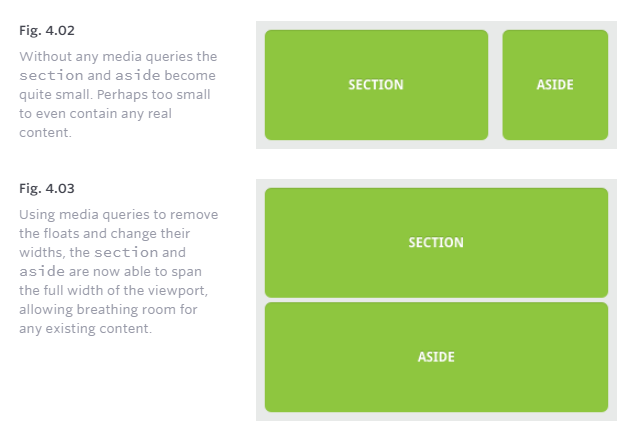

***

### Mobile First

The mobile first approach includes using styles targeted at smaller viewports as the default styles for a website, then use media queries to add styles as the viewport grows.

Mobile First Demo

```css
section,
aside {
  margin: 1.858736059%;
}
@media all and (min-width: 420px) {
  .container {
    max-width: 538px;
  }
  section {
    float: left;
    width: 63.197026%;
  }
  aside {
    float: right;
    width: 29.3680297%;
  }
}
```

[SEE RESULT](https://codepen.io/shayhowe/pen/KcApz)

***

### Viewport
Using the viewport meta tag with either the height or width values will define the height or width of the viewport respectively. Each value accepts either a positive integer or keyword. For the height property the keyword device-height value is accepted, and for the width property the keyword device-width is accepted.

```html
<meta name="viewport" content="width=device-width">
```

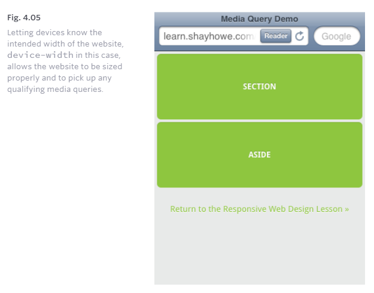

Viewport Scale

Values for initial-scale should always be a positive integer between 0 and 10.

```html
<meta name="viewport" content="initial-scale=2">
```

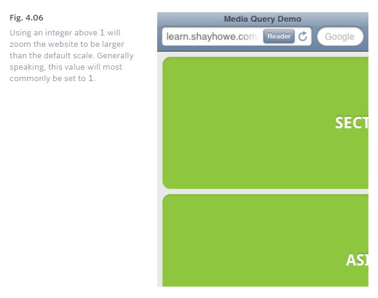

Viewport Resolution

When more control is needed, specifically over the resolution of a device, the target-densitydpi value may be used.

```html
<meta name="viewport" content="target-densitydpi=device-dpi">
```

Combining Viewport Values

```html
<meta name="viewport" content="width=device-width, initial-scale=1">
```

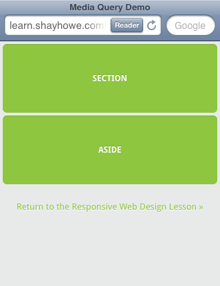

CSS Viewport Rule
Since the viewport meta tag revolves so heavily around setting the styles of how a website should be rendered it has been recommend to move the viewport from a meta tag with HTML to an @ rule within CSS.

```css
@viewport {
  width: device-width;
  zoom: 1;
}
```

***
***

### 3. flexible media : As viewports begin to change size media doesn’t always follow suit. Images, videos, and other media types need to be scalable, changing their size as the size of the viewport changes.

One quick way to make media scalable is by using the max-width property with a value of 100%. Doing so ensures that as the viewport gets smaller any media will scale down according to its containers width.

```html
img, video, canvas {
  max-width: 100%;
}
```

[SEE RESULT](https://codepen.io/shayhowe/pen/fDLAH)

***
***
***
# Floats


## What are floats used for?
floats can be used to create entire web layouts Floats are also helpful for layout in smaller instances.

This same layout could be accomplished using relative positioning on container and absolute positioning on the avatar as well.

```css
float: left;
float: right;
```


There are four valid values for the float property. **Left** and **Right** float elements those directions respectively. **None** (the default) ensures the element will not float and **Inherit** which will assume the float value from that elements parent element.

***

### Clearing the Float


```css
footer {
clear: both;
}
```


***

### Techniques for Clearing Floats

* **The Empty Div Method** is, quite literally, an empty div. 

```css
<div style="clear: both;"></div>
```
* **The Overflow Method** relies on setting the overflow CSS property on a parent element. If this property is set to auto or hidden on the parent element, the parent will expand to contain the floats, effectively clearing it for succeeding elements.

* **The Easy Clearing Method** uses a clever CSS pseudo selector (:after) to clear floats. Rather than setting the overflow on the parent, you apply an additional class like “clearfix” to it. Then apply this CSS:

```css
.clearfix:after { 
   content: "."; 
   visibility: hidden; 
   display: block; 
   height: 0; 
   clear: both;
}
```

***
***
***

# Grids

## :eight_pointed_black_star:  Don’t Overthink It Grids !!

***

### Columns

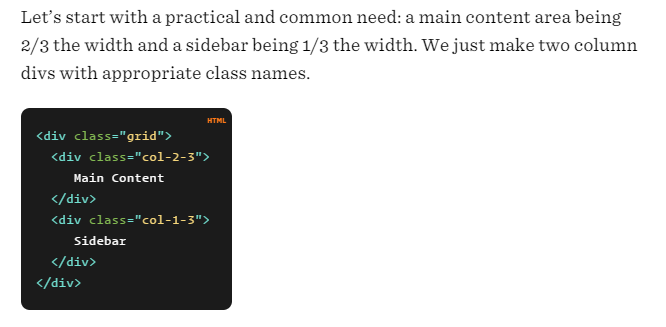
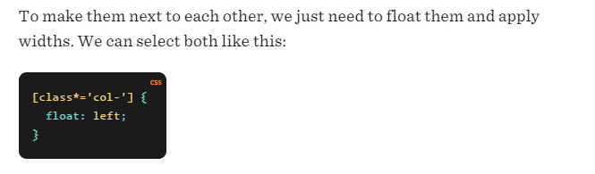
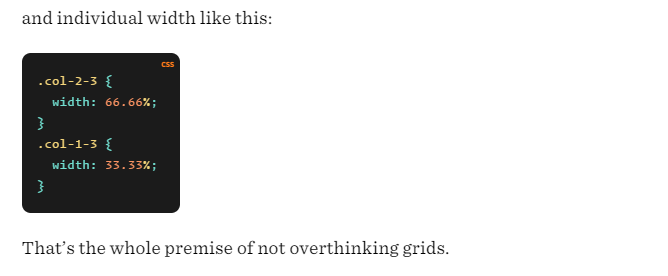

***
### Clearing contest

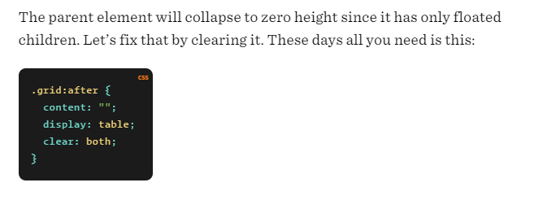

***
### Gutters

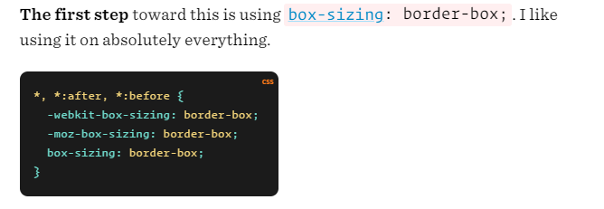
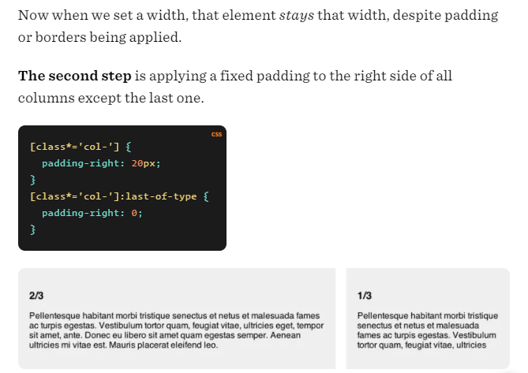

***

### Outside Gutters

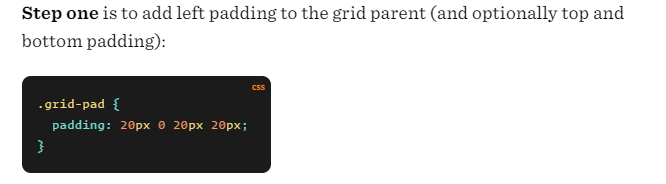
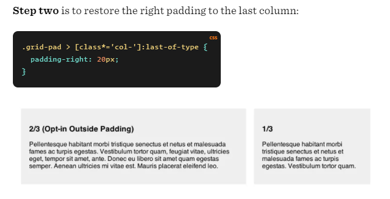

***
### More Column Choices
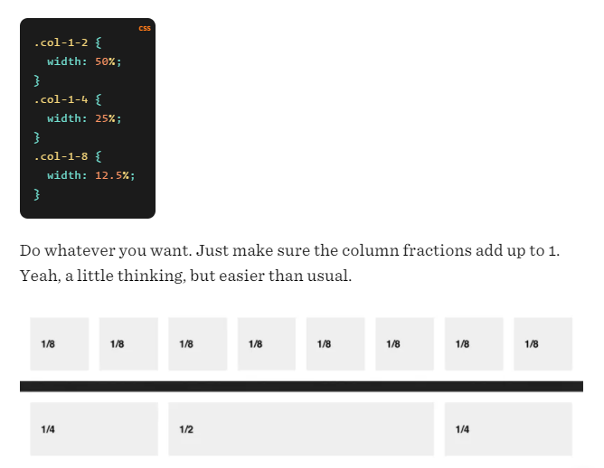
***

### Sass

```css
* {
  @include box-sizing(border-box);
}

$pad: 20px;

.grid {
  background: white;
  margin: 0 0 $pad 0;
  
  &:after {
    /* Or @extend clearfix */
    content: "";
    display: table;
    clear: both;
  }
}

[class*='col-'] {
  float: left;
  padding-right: $pad;
  .grid &:last-of-type {
    padding-right: 0;
  }
}
.col-2-3 {
  width: 66.66%;
}
.col-1-3 {
  width: 33.33%;
}
.col-1-2 {
  width: 50%;
}
.col-1-4 {
  width: 25%;
}
.col-1-8 {
  width: 12.5%;
}

/* Opt-in outside padding */
.grid-pad {
  padding: $pad 0 $pad $pad;
  [class*='col-']:last-of-type {
    padding-right: $pad;
  }
}
```
***
### Modules

```css
<div class="grid">
  <div class="col-2-3">
     <article class="module">
        stuff
     </article>
     <article class="module">
        stuff
     </article>
  </div>
  <div class="col-1-3">
    <aside class="module">
       Sidebar stuff. Sub modules?
    </aside>
  </div>
</div>
```
***
***
***

# SMACSS


### What is SMACSS ?!
SMACSS is a way to examine your design process and as a way to fit those rigid frameworks into a flexible thought process. It is an attempt to document a consistent approach to site development when using CSS.

***
### General Guidelines:
Styling should progress from broadest to most specific

* **base.css** should contain any general styling on top of what is provided by a reset.css or normalize.css file

Apply to elements such as body and main
Examples include styling of overall font and background color

* **layout.css** should contain general positioning on the page

Apply to elements such as header, footer, nav, aside
Classes and IDs can be included here

* **modules.css** should contain smaller components on the page
Apply to elements such as list items, individual images, specific paragraphs

Classes and descendant selectors should primarily be included here

* **state.css** should contain any styling that changes upon user interaction or state change

Apply to hover state, before or after clicking on a link, focus and blur effects

Pseudo-classes and pseudo-elements should be included here

* **theme.css** should contain small changes on top of all other normal styling

Applying temporary changes, such as a holiday theme

***

*Resources & Links*

*[Responsive Web Design](https://learn.shayhowe.com/advanced-html-css/responsive-web-design/)*

*[All about Floats](https://css-tricks.com/all-about-floats/)*

*[Grids](https://css-tricks.com/dont-overthink-it-grids/#top-of-site)*

*[SMACSS](http://smacss.com/)*

***

[HomePage](https://wafaankoush99.github.io/Reading-Notes/READMEcode301.html)  


contact wafadirawe@gmail.com
