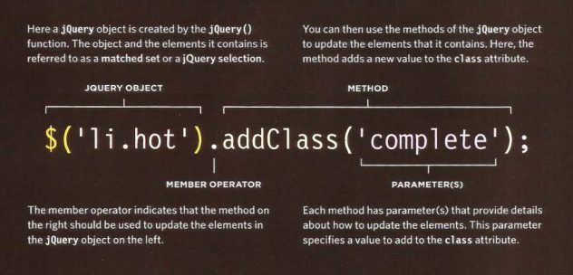

# What is jQuery?

jQuery is a javascript file that you include in your web pages.
It lets you to find elements using CSS-style selectors and the dosomething with jQuery methods.



EXAMPLE:

```html
<body>
<div i d="page"
1. In order to use jQuery, the first
thing you need to do is include
the jQuery script in your page.
You can see that it is included
before the closing </body> tag.
<hl id=" header">List</hl>
<h2>Buy groceries</h2>
<ul>
<li id="one" class="hot"><em>fresh</em> figs</li>
<li id="two" class="hot">pine nuts</ li>
<li id="three" class="hot">honey</ li>
<l i id="four">balsamic vinegar</ li>
</ ul>
</div>
G) <script src="js/jquery-1 .11.0.js"></script>
@ <script src="j s/basic-example.js"></scri pt>
</body>
```

```javascript
$(' :header').addClass('headline');
@ $(' l i : lt(3) ').hide(). fadeln(lSOO);
$('li').on('click', function() {
$(this) . remove();
}) ;
```

## LOADING JQUERY FROM A CDN

```html
<script src="//ajax .googl eapi s . com/ ajax/l i bs/ jquery/ 1.10. 2/ jquery .min. js ">
</ script>
<script>
window .jQuery 11 document. write (' <script src=" j s/j query- 1.10 . 2.j s 11><\jscri pt> ' )
</script>
```

## WHERE TO PLACE YOUR SCRIPTS?

Place the script at the end of the
page before the closing </body> tag, it will not affect
the rendering of the rest of the page

***
# 6 Reasons for Pair Programming

1. Greater efficiency
2. Engaged collaboration
3. Learning from fellow students
4. Social skills
5. Job interview readiness
6. Work environment readiness

***


[HomePage](https://wafaankoush99.github.io/Reading-Notes/READMEcode301.html)  


contact wafadirawe@gmail.com
