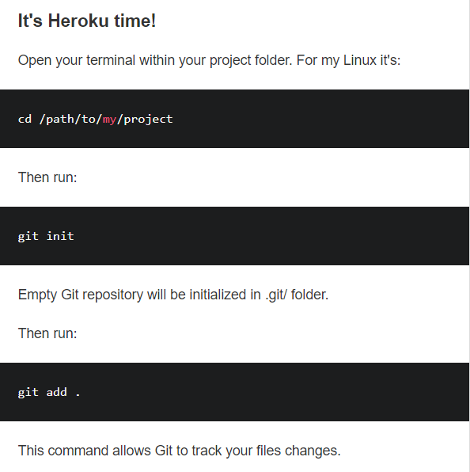
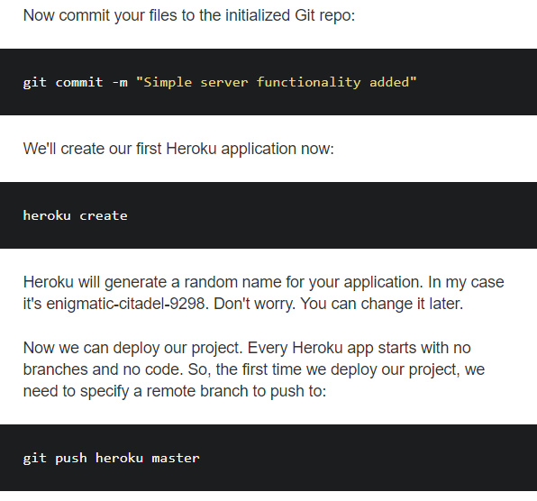

 # Heroku Command Line Interface (CLI)

You use the CLI to manage and scale your applications, provision add-ons, view your application logs, and run your application locally.

# Node.js
Node.js is an open source, cross-platform runtime environment, which allows you to build server-side and networking applications. It's written in JavaScript and can be run within the Node.js runtime on any platform.

```js
var http = require("http");

http.createServer(function(request, response) {
  response.writeHead(200, {"Content-Type": "text/plain"});
  response.write("It's alive!");
  response.end();
}).listen(3000);
```
run :
```
node server.js
```

*Heroku* is a cloud platform as a service. It allows you to deploy your web server, so everyone could see how awesome you are as a web developer.

declare some variables:

***

```
var http = require("http");
```
 will give you the key to Node's HTTP functionality.

***

```
var fs = require("fs");
```
for possibility to interact with the file system. 

***

```
var path = require("path");
```
allows you to handle file paths.

***

```
var mime = require("mime");
```
allows you to determine a file's MIME-type.

---

 You also need to set the Content-Type header with proper MIME-type. That's why we need this plug-in.

```
{
  "name" : "blog",
  "version" : "0.0.1",
  "description" : "My minimalistic blog",
  "dependencies" : {
    "mime" : "~1.2.7"
  }
}
```

We added our "mime" plug-in and now it's time to download it. We'll use built-in Node Package Manager. Just run:

```
npm install
```






***


[HomePage](https://wafaankoush99.github.io/Reading-Notes/READMEcode301.html)  


contact wafadirawe@gmail.com
