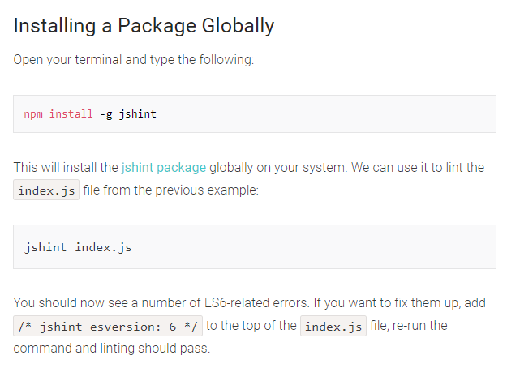
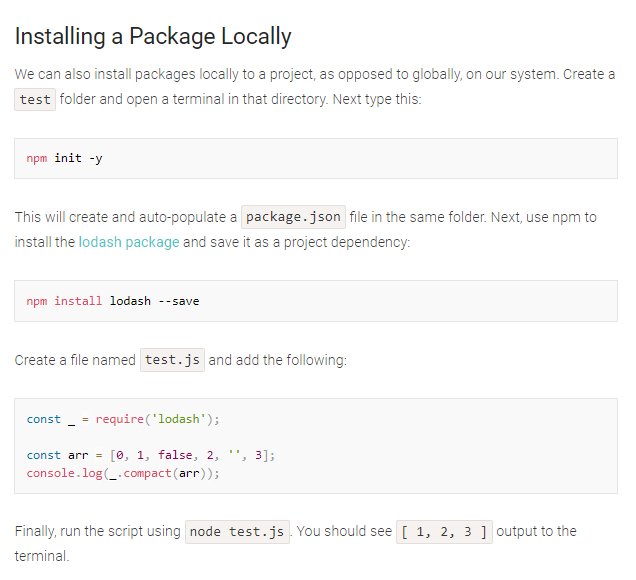
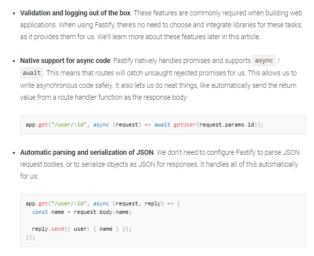

# Node.js

## What Is Node.js?
Node.js® is a JavaScript runtime built on Chrome’s V8 JavaScript engine.
Node.js is an event-based, non-blocking, asynchronous I/O runtime that uses Google’s V8 JavaScript engine and libuv library.
This means that Node.js is a program we can use to execute JavaScript on our computers. In other words, it’s a JavaScript runtime.

You can check that Node is installed on your system by opening a terminal and typing `node -v`. If all has gone well, you should see something like `v12.14.1` displayed. This is the current LTS version at the time of writing.

***

## How to Migrate Your App from Express to Fastify

***

[HomePage](https://wafaankoush99.github.io/Reading-Notes/READMEcode301.html)  

contact wafadirawe@gmail.com
