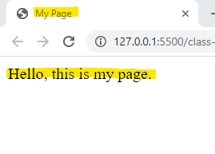
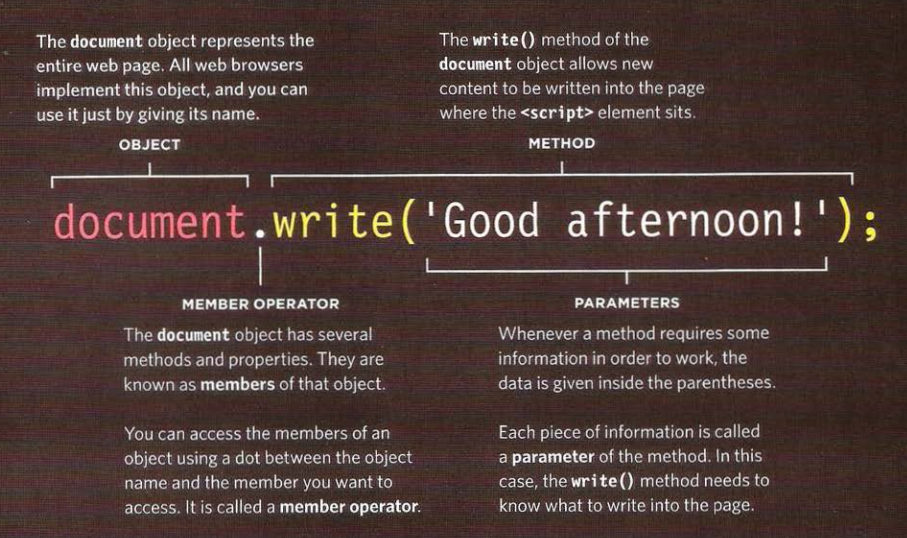

# Introductory HTML and JavaScript

## STRUCTURE

**Hypertext Markup Language**, a standardized system for tagging text files to achieve font, colour, graphic, and hyperlink effects on World Wide Web pages. 


**HTML elements** : Elements are usually made up of two tags: an opening tag and a closing tag. Each HTML element tells the browser something about the information that sits between its opening and closing tags.

*Tags act like containers. They tell you something about the information that lies between their opening and closing tags.*


***

**Attributes**

provide additional information about the contents of an element.


- *Attribute name* indicates what kind of extra information you're supplying about the elemen's content.
- *Attribute value* is the setting for the attribute.
- **Different attributes can have different values** 

***

**Body, Head & Title**


1. *Head* This contains information about the page.
3. *Title* The contents of it are either shown in the top of the browser, above where you usually type in the URL.
1. *Body* Everything inside this element is shown inside the main browser window.


 


***


**Looking at how other sites are buiLt**

Click on the right of the mouse and select View Page Source,You should see a new window appear, and it will contain the source code that was used to create this page.


***

## EXTRA MARKUP 


**DOCTYPE**


Because there have been several versions of HTML, each web page should begin with a DOCTYPE declaration to tell a browser which version of HTML the page is using.


```
1  <!DOCTYPE html>
```

*** 


**Comments in Html**

If you want to add a comment to your code that will not be visible in the user's browser, you can add the text between these characters:

```
<!-- Comment goes here -->
```

***


**ID Attribute**

Every HTML element can carry the id attribute. It is used to uniquely identify that element from other elements on the page.


```
<p id="pullqoute"> Hello World </p>
```

##### ( The Id attribute is known as a global attribute because it can be used on any element )


***


**Class Attribute**


Every HTML element can also carry a class attribute. Sometimes, rather than uniquely identifying one element within a document, you will want a way to identify several elements as being different from the other elements on the page.


```
<p class="important admittance">Hours: 10:00 – 18:00
(No admittance after 17:30)</p>
```


##### ***Note*** By default, using these attributes does not affect the presentation of an element. It will only change their appearance if there is a CSS rule that indicates it should be displayed differently.


***


**Block elements**

Some elements will always appear to start on a new line in the browser window. These are known as block level elements.

***example*** 
```
<h1>, <p>, <ul>, and <li>
```


***


**Inline elements**


Some elements will always appear to continue on the same line as their neighbouring elements. These are known as inline elements.

***examples***


```
<a>, <b>, <em>, and .
```


***


**Grouping text & Elements in a block**

The `<div>` element allows you to
group a set of elements together
in one block-level box.


***

**Grouping text & Elements inline**

The `<span>` element acts like an inline equivalent of the `<div>` element. It is used to either:

 -- *1. Contain a section of text where there is no other suitable element to differentiate it from its surrounding text.*

 -- *2.  Contain a number of inline elements.*


***

**Iframes**

`<iframe>`
An iframe is like a little window that has been cut into your page — and in that window you can see another page. The term iframe is an abbreviation of inline frame. created using the `<iframe>` element:
- src
- width
- height
 
***

**Scrolling**


Scrollbars allow the user to move around the frame to see more content. It can take one of three values: yes (to show scrollbars), no (to hide scrollbars) and auto (to show them only if needed).

```

<iframe
   src="http://maps.google.co.uk/maps?q=moma+new+york &amp output=embed"
   width="450"
   height="350"
   frameborder="0"
   scrolling="no">

</iframe>

```

*** 


**Information about your pages**

The `<meta>` element lives
inside the `<head>` element and
contains information about that
web page, it does not have a closing tag. It uses attributes to carry the information. *displayed in search engine results*


The value of the name attribute can be anything you want it to be:

- Description
- Keywords
- Robots
- Author
- Pragma
- Expires

```
<!DOCTYPE html>
<html>
<head>
<title>Information About Your Pages</title>
<meta name="description"
content="An Essay on Installation Art" />
<meta name="keywords"
content="installation, art, opinion" />
<meta name="robots"
content="nofollow" />
<meta http-equiv="author"
content="Jon Duckett" />
<meta http-equiv="pragma"
content="no-cache" />
<meta http-equiv="expires"
content="Fri, 04 Apr 2014 23:59:59 GMT" />
</head>
<body>
</body>
</html>
```

***

**Important Escape Charachters**

Used to include special characters in your pages such as:

- Cent sign &cent;

```
&cent;
&#162;
```


- Pound sign &pound;


```
&pound;
&#163;
```


- Yen sign &yen;

```
&yen;
&#165;
```


- euro sign &euro;

```
&euro;
&#8364; 
```


- Copyright symbol &copy;

```
&copy;
&#169;
```


- Registered trademark &reg;

```
&reg;
&#174;
```


- Trademark &trade;

```
&trade;
&#8482;
```


- Multiplication sign &times;

```
&times;
&#215; 
```


- Division sign &divide;

```
&divide;
&#247;
```


***

## HTML LAYOUT


- The `<header>` element used to contain the site name and the main navigation. 

***


- The `<footer>` element contains copyright information, along with links to the privacy policy and terms and conditions.


***


- Each individual `<article>` and `<section>` element can also have its own `<header>` and `<footer>` elements to hold the header or footer information for that section within the page.


***


- The `<nav>` element is used to contain the major navigational blocks on the site such as the primary site navigation.


***


- The `<article>` element acts as a container for any section of a page that could stand alone and potentially be syndicated.


***


- `<aside>` : 

 1. When the `<aside>` element is used inside an `<article>` element, it should contain information that is related to the article but not essential to its overall meaning. 
 2. When the `<aside>` element is used outside of an `<article>` element, it acts as a containerfor content that is related to the entire page. 


***


 - The `<section>` element groups related content together, and typically each section would have its own heading.


***


 - The purpose of the `<hgroup>` element is to group together a set of one or more `<h1>` through `<h6>` elements so that they are treated as one single heading.


***


 - `<figure>` It can be used to contain any content that is referenced from the main flow of an article.


 *Examples of usage include:*


1. Images

2. Videos

3. Graphs

4. Diagrams

5. Code samples

6. Text that supports the main body of an article 

It should also contain a `<figcaption>` element which provides a text decription for the content of the `<figure>` element. 


***


- `<div>` element will remain an important way to group together related elements.


***


- `<a>` element around a block level element that contains child elements. This allows you to turn an entire block into a link.

*** 

**block-level elements**

- **CSS**

```

header, section, footer, aside, nav, article, figure
{
display: block;}
```

- **Html** 

```

<!--[if lt IE 9]>
<script src="http://html5shiv.googlecode.com/svn/
trunk/html5.js"></script>
<![endif]-->

```

***

## PROCESS & DESIGN


-  It's important to understand who your target audience is, why they would come to your site, what information they want to find and when they are likely to return.
-  Site maps allow you to plan the structure of a site.
-  Wireframes allow you to organize the information that will need to go on each page.
-  Design is about communication. Visual hierarchy helps visitors understand what you are trying to tell them.
-  You can differentiate between pieces of information using size, color, and style.
-  You can use grouping and similarity to help simplify the information you present.


***

## THE ABC OF PROGRAMMING

**What is a Script?**

A script is a series of instructions that a computer can follow to achieve a goal.

Each time the script runs, it might only use a subset of all the instructions.


Computers approach tasks in a different way than humans, so your instructions must let the computer solve the task prggrammatically.


To approach writing a script, break down your goal into a series of tasks and then work out each step needed to complete that task (a flowchart can help). 

***

**How do computers fit in the world around them?**

- Computers creat models of the world using data.

- The modules use objects to represent physical things. Object can have: prperties that tell us about the object; methods that perform tasks using the properties of that object; events which are triggered when a user interacts with the computer.

- Programmers can write code to say "When this event occures, run that code."

- Web browsers use HTML markup to create a mpdel of the web page. Each element creates its own node (which is a kind of object).

- To make web pages interactive, you write code that uses the browser's model of the web page.

***


**How do I write a script for a web page?**

```
<script src="js/ add-content.js"></ script>
```


- It is best to keep JavaScript code in its own JavaScript file. JavaScript files are text files (like HTML pages and CSS style sheets), but they have the . js extension.


- The HTML `<script>` element is used in HTML pages to tell the browser to load the JavaScript file (rather like the `<link>` element can be used to load a CSS file).


- If you view the source code of the page in the browser, the JavaScript will not have changed the HTML, because the script works with the model of the web page that the browser has created.


 


***

[HomePage](https://wafaankoush99.github.io/Reading-Notes/)  


