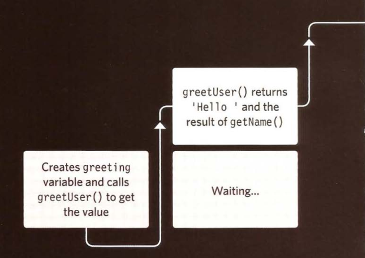

# EROR HANDLING & DEBUGGING

## The Stack:

JS interpreter process one line of code at a  time. When statement needs data from another function, it stacks the new function of top of the current task.

If you understand execution contexts (which have two
stages) and stacks, you are more likely to find the error in your code.

***

**Debugging** is the process of finding errors. It involves a process of deduction.

***

The **console** helps narrow down the area in which the
error is located, so you can try to find the exact error.
 
 ***

JavaScript has 7 different types of errors. Each creates its own error object, which can tell you its line number and gives a description of the error.

***

If you know that you may get an error, you can handle
it gracefully using the try, catch, finally statements.

Use them to give your users helpful feedback.

***

*sources:*
*ducket javascript |*

[HomePage](https://wafaankoush99.github.io/Reading-Notes/READMEcode201.html)  

contact wafadirawe@gmail.com