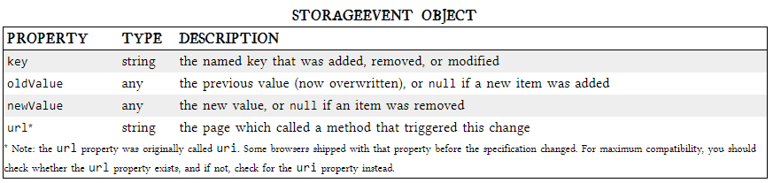

# LOCAL STORAGE FOR WEB APPLICATIONS

Persistent local storage is one of the areas where native client applications have held an advantage over web applications, they can be used for persistent local storage of small amounts of data.

**three potentially dealbreaking downsides:**

1- Cookies are included with every HTTP request, thereby slowing down your web application by needlessly transmitting the same data over and over.

2- Cookies are included with every HTTP request, thereby sending data unencrypted over the internet (unless your entire web application is served over SSL).

3- Cookies are limited to about 4 KB of data — enough to slow down your application (see above), but not enough to be terribly useful.

**What we really want is**

- a lot of storage space
- on the client
- that persists beyond a page refresh
- and isn’t transmitted to the server

***

**what is HTML5 Storage?**


 Simply put, it’s a way for web pages to store named key/value pairs locally, within the client web browser. Like cookies, this data persists even after you navigate away from the web site, close your browser tab, exit your browser, or what have you. Unlike cookies, this data is never transmitted to the remote web server (unless you go out of your way to send it manually). Unlike all previous attempts at providing persistent local storage, it is implemented natively in web browsers, so it is available even when third-party browser plugins are not.

 *** 

 **HTML5 STORAGE SUPPORT**

IE      | 8.0+
----------------
FIREFOX | 3.5+ 
---------------
CHROME | 4.0+
----------------
OPERA | 10.5+
----------------
IPHONE | 2.0+
-----------------
ANDROID | 2.0+
-----------------

***

**↶ check for HTML5 Storage**
```

function supports_html5_storage() {
  try {
    return 'localStorage' in window && window['localStorage'] !== null;
  } catch (e) {
    return false;
  }
}
```

***

**USING HTML5 STORAGE**


HTML5 Storage is based on named key/value pairs. You store data based on a named key, then you can retrieve that data with the same key. The named key is a string. The data can be any type supported by JavaScript, including strings, Booleans, integers, or floats. However, the data is actually stored as a string. If you are storing and retrieving anything other than strings, you will need to use functions like parseInt() or parseFloat() to coerce your retrieved data into the expected JavaScript datatype.


***

**TRACKING CHANGES TO THE HTML5 STORAGE AREA**


If you want to keep track programmatically of when the storage area changes, you can trap the storage event. The storage event is fired on the window object whenever setItem(), removeItem(), or clear() is called and actually changes something.

At this point, the variable e will be a StorageEvent object, which has the following useful properties.





The storage event is not cancelable. From within the handle_storage callback function, there is no way to stop the change from occurring. It’s simply a way for the browser to tell you, “hey, this just happened. There’s nothing you can do about it now; I just wanted to let you know.”


[For  more infornation & details CLICK HERE](http://diveinto.html5doctor.com/storage.html#divingin)

---


[HomePage](https://wafaankoush99.github.io/Reading-Notes/READMEcode201.html)  


contact wafadirawe@gmail.com


