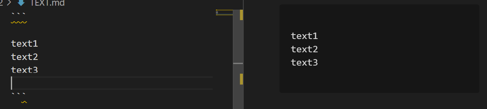

# LEARNING MARKDOWN
***
## WHAT IS MARKDOWN?
Markdown is a regular text with a few non-alphabetic characters thrown in and way to style text on the web.
***
## BASIC WRITING AND FORMATING SYNTAX

* Headings


* Styling text

Syntax | Result
-------|----------------
** **  | **Bold**
-- --  | **Bold**
text inside * *    | *Italic*
text inside - -    | *Italic*
text inside ~~ ~~  | ~~Sktrikethrough~~
text inside ** ** and _ _ between words | **Bold and _nested_ _italic_**
text inside *** *** | ***All bold and italic***
[name the link](put a link here, google for example) | [Google](https://www.google.com/)
text inside backticks | `Quoting code`
\ before every charachter | \**Ignoring\** Markdown \*formatting\*
***
* Greater Than symbol **>** make qouting text
> Quoting text
***
* Triple backticks format text into its own **distinct block**. 
``` 
Example:
```

***
#### To make orederd list use * or - 
- First 
- Seconed
- Third
#### To make unordered list use numbers 1. 2. 2. 
1. First
2. Second
3. Third
#### Create a nested list by indenting one or more list items below another item
1. First list item
   - Socend nested list item
      - Third nested list item
***
```
To create a **task list**, preface list items with a regular space character followed by [ ].
To mark a task as complete, use [x]. and you will see this result for example:
```

***
You can **mention** a person or team on GitHub by typing @ plus their username or team name.
[See details](https://docs.github.com/en/github/managing-subscriptions-and-notifications-on-github/about-notifications)
***
You can add **emoji** to your writing by typing :EMOJICODE:.
[Emogi cheat sheat](https://github.com/ikatyang/emoji-cheat-sheet/blob/master/README.md)
***
Create **tables** 
```
First Header | Second Header
------------ | -------------
Content from cell 1 | Content from cell 2
Content in the first column | Content in the second column
```
First Header | Second Header
------------ | -------------
Content from cell 1 | Content from cell 2
Content in the first column | Content in the second column
***
*refrences*
[mastering markdown](https://guides.github.com/features/mastering-markdown/)
[basic writing syntax](https://docs.github.com/en/github/writing-on-github/basic-writing-and-formatting-syntax)
***
## GITHUB PAGES 
github pages lets you treat your websites content with the same level of care as the source code and all of 
your projects, because your websites files are part of a github repository you can maintain them using the same family tools
and workflows you already use on github, you can use the github flow to manage changes to your websites.
***
## HOW TO BUILD YOUR SITE FROM GENERATE ONE FOR YOUR PROJECT
#### Create a repository and Go to the folder where you want to store your project, and clone the new repository
#### then Enter the project folder and add an index.html file.


[GitHub pages](https://pages.github.com/)
***
*contact us wafadirawe@gmail.com*
