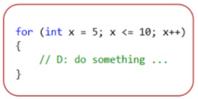
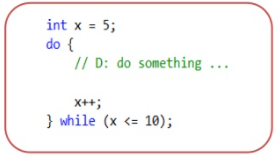

 # JavaScript & jQuery

 ## COMPARISION OPERATORS


 ***


 

 ***


## LOOPS
***
Loops are handy, if you want to run the same code over and over again, each time with a different value.


***


## THE MOST COMMON TYPES OF LOOPS:

***

###  **For loop** :
 Is used for iterating over a sequence.



*example*
```
var sum = 0;
for (var i = 1; i <= 50; i++) {
   sum = sum + i;
}
alert("Sum = " + sum);    // => Sum = 1275
```
**Sum = 1275**

***

###  **While loop**
is used to repeat a section of code an unknown number of times until a specific condition is met.

*example*

```
var sum = 0;
var number = 1;
while (number <= 50) {  // -- condition
  sum += number;        // -- body
  number++;             // -- updater
}
alert("Sum = " + sum);  
```
**Sum = 1275**




[Home Page](https://wafaankoush99.github.io/Reading-Notes/)
***
*contact wafadirawe@gmail.com*


 